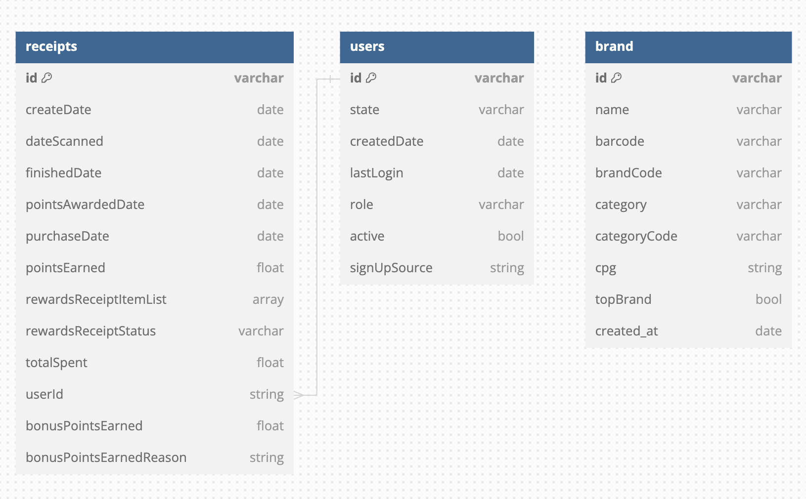

# Fetch OA

This repository contains the solutions to the Fetch OA tasks, including data processing and analysis using Apache Spark.

## Table of Contents

- [Overview](#overview)
- [Q1: Entity-Relationship Diagram](#q1-entity-relationship-diagram)
- [Q2: Data Analysis and Transformation](#q2-data-analysis-and-transformation)
- [Q3: Data Quality Analysis](#q3-data-quality-analysis)
- [How to Run](#how-to-run)
- [Dependencies](#dependencies)
- [File Descriptions](#file-descriptions)

## Overview

This project involves reading and processing JSON data, performing data analysis and transformation, and identifying data quality issues. The tasks are divided into three questions (Q1, Q2, and Q3).

## Q1: Entity-Relationship Diagram

Please refer to the `Q1_ER_Diagram.png` for the Entity-Relationship Diagram related to the data.



## Q2: Data Analysis and Transformation

Q2 involves analyzing and transforming the data to extract useful insights. The results can be obtained by running the `Q2.py` script.

### How to Run Q2

```sh
spark-submit Q2.py
